## 有需求才有动力~

有时候经常需要将md文件当中的图片离线保存下来,指不定那一天图床挂了,图片找不到了!但是typora没有一键保存到本地图片功能!,必须要一个个右键保存才可以!!!!太坑爹!!!

## 下载

* [github下载](https://github.com/superBiuBiuMan/MarkdownPictureDownLoadAndReplace) 
* [gitee下载](https://gitee.com/superBiuBiu/MarkdownPictureDownLoadAndReplace)

## 原理

```
读取指定目录下的所有文件 => 获取md文件并将路径保存到数组A => 遍历每一个md文件,使用正则判断是否有图片链接

=> 当前md的文件下所有图片链接保存到数组B当中的某一项当中(使用push),重复此操作

=> 弹出一个数组A的值(也就是md文件的路径) => 弹出一个数组B(也就是当前md所对应的图片链接)

=> 对数组B进行遍历访问并保存图片到本地 => 替换内容 => 遍历完成后写入新内容
```

### 具体看源代码吧,我把注释写的挺详细的

## 更新

* 1.1.0发布~
  * 匹配文件内图片链接的正则变更
  * 替换文件图片链接不使用正则而使用字符串进行替换
  * 添加UA访问图片
  * 保存的文件名称如果没有扩展名,就以时间戳为名称且不添加扩展名(因为md读取的时候即使没有扩展名也可以正常读取)
* 1.0.0发布~

## 使用

* **nodejs环境**
  * 直接下载源码,记得**先安装下依赖**!然后 `node ./index.js`输入安装提示输入文件地址即可(**注意要是文件夹!!!**)

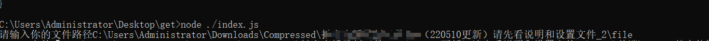

* **window环境** 尝试了下打包,感觉打包的文件好大,打包过程
  * 全局安装下 `npm install pkg -g` [pkg地址](https://github.com/vercel/pkg)

使用也很简单,双击运行输入**文件夹路径**即可,**文件夹路径**,**文件夹路径!**

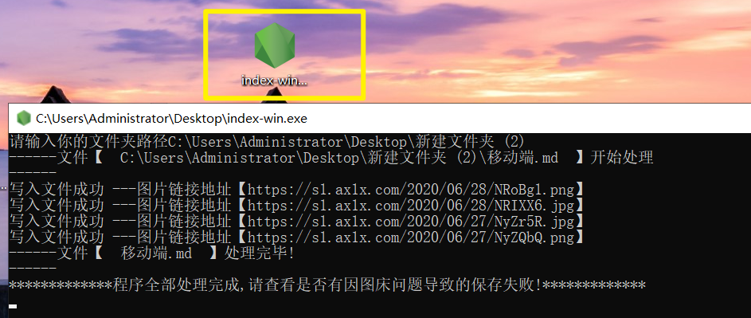


### 我打包nodejs的一些配置

* 然后运行`npm pkg -g` ,然后会下载三个包
  * `index-linux` `index-macos` `index-win`
* 配置了下文件(具体的可以看官网,我这里直接copy了别人的) package.json

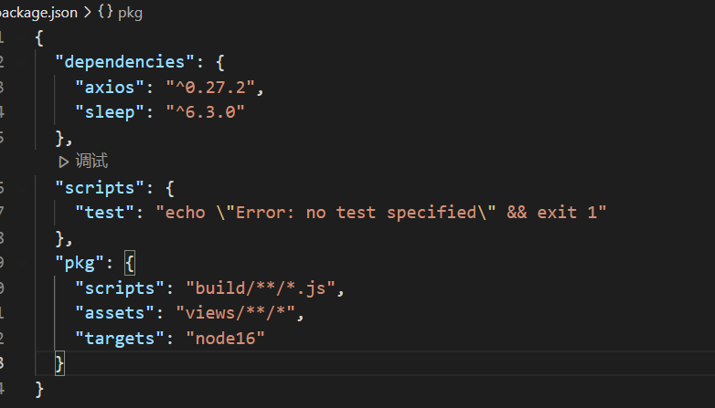

```js
  "scripts": {
    "test": "echo \"Error: no test specified\" && exit 1"
  },
  "pkg": {
    "scripts": "build/**/*.js",
    "assets": "views/**/*",
    "targets": "node16"
  }
```

* 然后生成三个平台的运行文件(可以有配置生成哪一个平台文件,具体看官网就可以~我这里就不研究了)

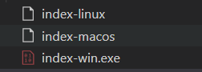

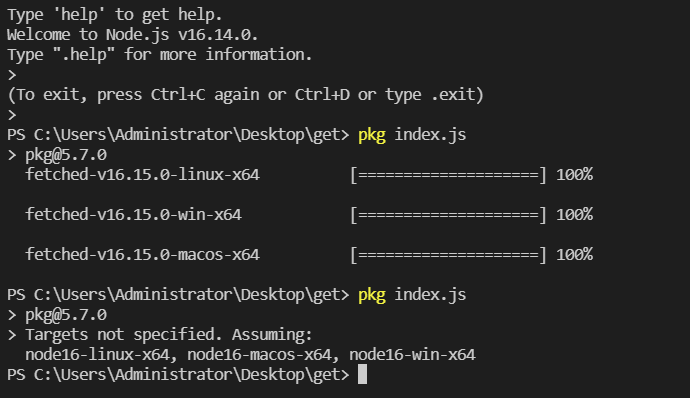

## 注意下

* 由于担心访问过快导致被屏蔽,这里设置了300毫秒的等待,每访问一次图片网站就等待300毫秒,当然,你可以自己更改下~

* 修改 `utils\index.js`

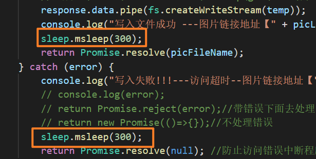

## 使用效果

* 使用后md当中的图片链接就被替换了
* 测试了下 有链接的,有img标签的`移动端md`

```
//普通的

=>替换为了


=>替换为了


都替换正常和显示正常
```


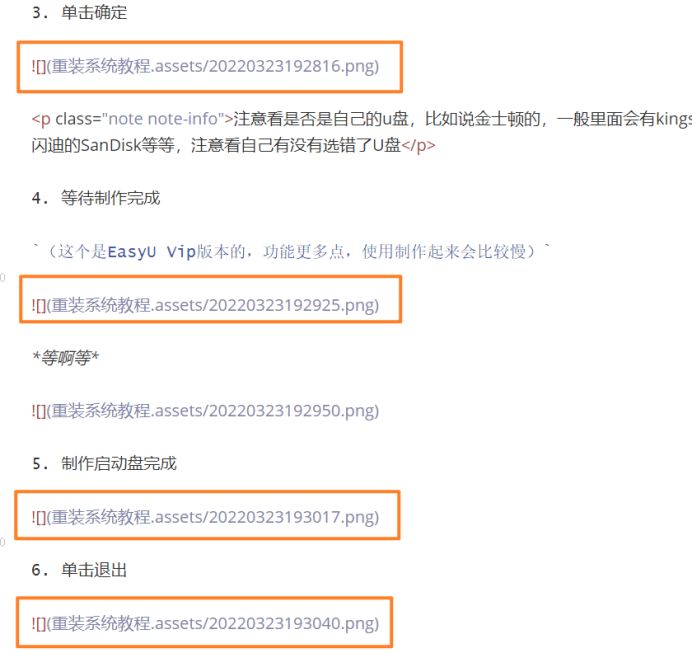

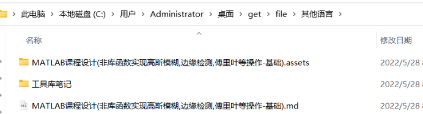

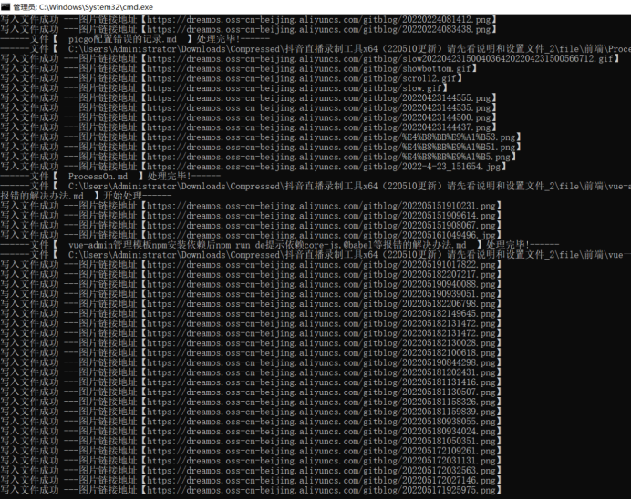

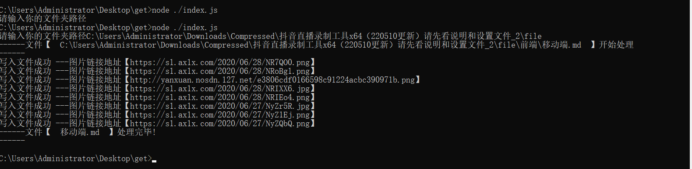

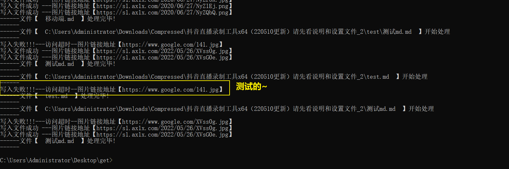

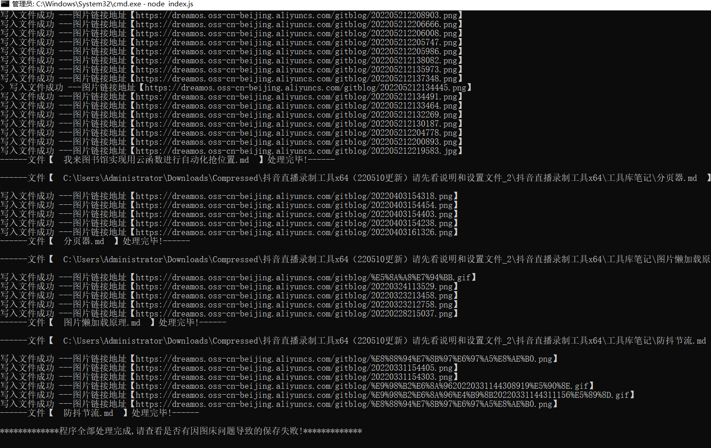

